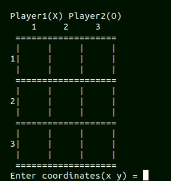

## ASCII Art
You must have gcc and Magick++ to run this.
Run the following commands:
```
g++ -o art art.cpp `Magick++-config --cppflags --cxxflags --ldflags --libs`
./art /path/to/image
```
Original             |  ASCII
:-------------------------:|:-------------------------:
  |  

## Game of Life
Run the following commands:
```
g++ game.cpp main.cpp -o game
./game
```


For unit tests:
```
g++ tests.cpp game.cpp -o tests
./tests
```

## Tic Tac Toe


To play PvP:
```
g++ -o game game.cpp main.cpp
./game
```
To enable AI play, you must create the data for it by running:
```
g++ -o gen generate.cpp game.cpp ai.cpp
./gen
```
To play against Unbeatable Minimax AI:
```
g++ -o game game.cpp main.cpp ai.cpp -DAI
./game
```
To see two AIs fight:
```
g++ -o game game.cpp main.cpp ai.cpp -DAI2
./game <ai1> <ai2>
```
where ai1, ai2 ∈ {random_ai, find_winning_move_ai, find_winning_and_losing_move_ai, minimax_ai}

For unit tests:
```
g++ tests.cpp ai.cpp game.cpp -o tests
./tests
```

## Authenticate
Use the `.db` file to enter user data.
To authenticate against it:
```
g++ main.cpp -o main -lcrypto -lsqlite3
./main
```
